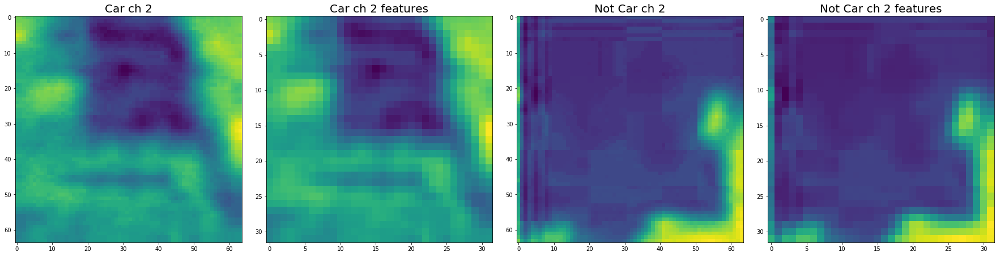

# Vehicle Detection

[Video demo](https://www.youtube.com/watch?v=I71cHXfSWxw&feature=youtu.be)


## Overview

Vehicle detection using these machine learning and computer vision techniques.

* Linear SVM
* HOG(Histogram of Oriented Gradients) feature extraction
* Color space conversion
* Space binning
* Histogram of color extraction
* Sliding Window

## Note

First, you need to get training data(cars and not-cars). You can get car images from [GTI vehicle image database](http://www.gti.ssr.upm.es/data/Vehicle_database.html), [KITTI vision benchmark](http://www.cvlibs.net/datasets/kitti/)). And over 1500 images per each is good for this project.

## Dependencies

* Python >= 3.4

## Set up environment

```
pip install -r requirements.txt
```

## Run Code

```
python video_main_process.py
```

## Histogram of Oriented Gradients (HOG)
I began by loading all of the vehicle and non-vehicle image paths from the provided dataset. The figure below shows a random sample of images from both classes of the dataset.    

The code for extracting HOG features from an image is defined by the function `get_hog_features` and is contained in the python file named "features.py".
 
The figure below shows a comparison of a car image and its associated histogram of oriented gradients, as well as the same for a non-car image.





The function `extract_features` in the python file named "features.py" accepts a list of image paths and HOG parameters (as well as one of a variety of destination color spaces, to which the input image is converted), and produces a flattened array of HOG features for each image in the list.

Next, in the python file named "training.py" I define parameters for HOG feature extraction and extract features for the entire dataset. These feature sets are combined and a label vector is defined (1 for cars, 0 for non-cars). The features and labels are then shuffled and split into training and test sets in preparation to be fed to a linear support vector machine (SVM) classifier. 


## Training classifier
I settled on my final choice of HOG parameters based upon the performance of the SVM classifier produced using them. I considered not only the accuracy with which the classifier made predictions on the test dataset, but also the speed at which the classifier is able to make predictions. There is a balance to be struck between accuracy and speed of the classifier, and my strategy was to bias toward speed first, and achieve as close to real-time predictions as possible, and then pursue accuracy if the detection pipeline were not to perform satisfactorily.

The final parameters were chosed as below : YUV colorspace, 15 orientations, 8 pixels per cell, 2 cells per block, and ALL channels of the colorspace.

    Using: 15 orientations 8 pixels per cell and 2 cells per block
    Feature vector length: 11988
    0.84 Seconds to train SVC...
    Test Accuracy of SVC =  0.9863

I trained a linear SVM with the default classifier parameters and using HOG features alone and was able to achieve a test accuracy of 98.63%.

## Sliding window
In the python file named "sliding_window.py" I adapted the method `find_cars` from the lesson materials. The method combines HOG feature extraction with a sliding window search, but rather than perform feature extraction on each window individually which can be time consuming, the HOG features are extracted for the entire image (or a selected portion of it) and then these full-image features are subsampled according to the size of the window and then fed to the classifier. The method performs the classifier prediction on the HOG features for each window region and returns a list of rectangle objects corresponding to the windows that generated a positive ("car") prediction.

I explored several configurations of window sizes and positions, with various overlaps in the X and Y directions.

The final algorithm calls `apply_sliding_window` for each window scale and the rectangles returned from each method call are aggregated. In previous implementations smaller (0.5) scales were explored but found to return too many false positives, and originally the window overlap was set to 50% in both X and Y directions, but an overlap of 75% in the Y direction (yet still 50% in the X direction) produced more redundant true positive detections, which were preferable given the heatmap strategy described below. Additionally, only an appropriate vertical range of the image is considered for each window size (e.g. smaller range for smaller scales) to reduce the chance for false positives in areas where cars at that scale are unlikely to appear. 

The image below shows the rectangles returned by `apply_sliding_window`  drawn onto one of the test images in the final implementation. Notice that there are several positive predictions on each of the near-field cars, and several positive predictions on a car in the oncoming lane.


## Creating heatmap

Because a true positive is typically accompanied by several positive detections, while false positives are typically accompanied by only one or two detections, a combined heatmap and threshold is used to differentiate the two. The `add_heat` function increments the pixel value (referred to as "heat") of an all-black image the size of the original image at the location of each detection rectangle. Areas encompassed by more overlapping rectangles are assigned higher levels of heat. The following image is the resulting heatmap from the detections in the image above:


## More heatmaps

A threshold is applied to the heatmap (in this example, with a value of 1), setting all pixels that don't exceed the threshold to zero. The result is below:


## Labeled image

The scipy.ndimage.measurements.label() function collects spatially contiguous areas of the heatmap and assigns each a label:


## Resulting bonding boxes

The results of passing all of the project test images through the above pipeline are displayed in the images below:


## Applying to video

The code for processing frames of video is contained in the python file named "video_main_process.py" and is identical to the code for processing a single image described above. The result was display in the video named "result.mp4".

The problems that I faced while implementing this project were mainly concerned with detection accuracy. Balancing the accuracy of the classifier with execution speed was crucial. Scanning 190 windows using a classifier that achieves 98% accuracy should result in around 4 misidentified windows per frame.

The pipeline is probably most likely to fail in cases where vehicles (or the HOG features thereof) don't resemble those in the training dataset, but lighting and environmental conditions might also play a role (e.g. a white car against a white background). As stated above, oncoming cars are an issue, as well as distant cars (as mentioned earlier, smaller window scales tended to produce more false positives, but they also did not often correctly label the smaller, distant cars). I believe that the best approach, given plenty of time to pursue it, would be to combine a very high accuracy classifier with high overlap in the search windows. The execution cost could be offset with more intelligent tracking strategies, such as:

1. determine vehicle location and speed to predict its location in subsequent frames.
2. begin with expected vehicle locations and nearest (largest scale) search areas, and preclude overlap and redundant detections from smaller scale search areas to speed up execution.
3. use a convolutional neural network, to preclude the sliding window search altogether.


